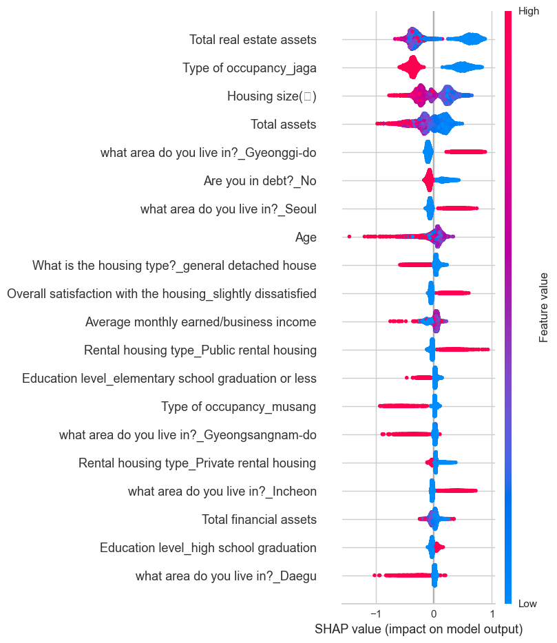
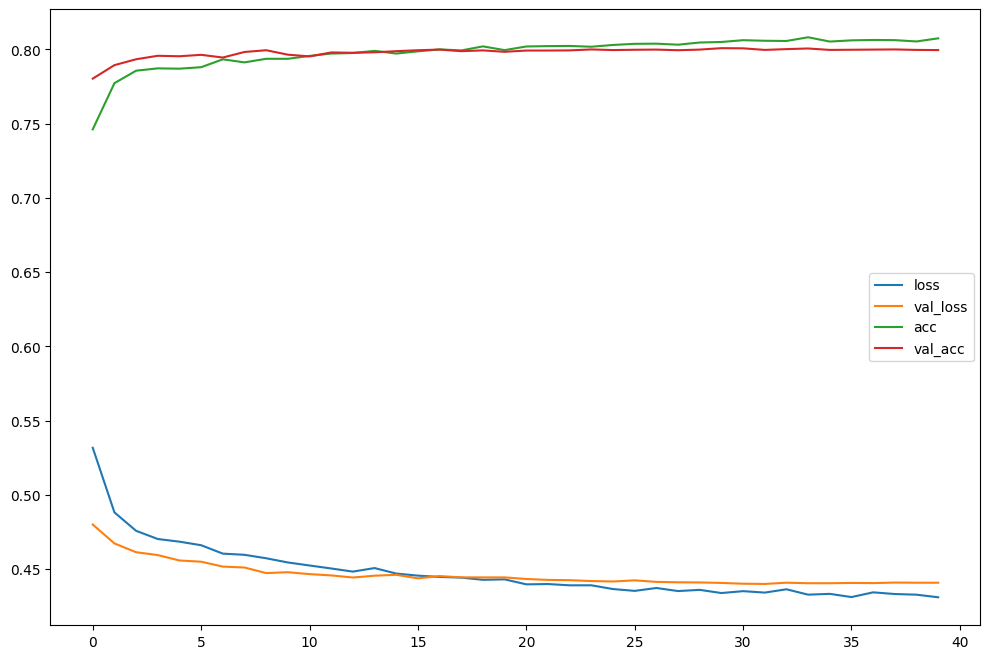
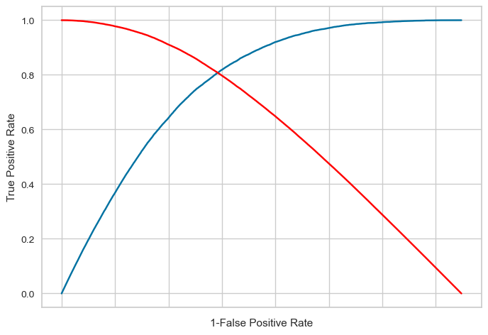
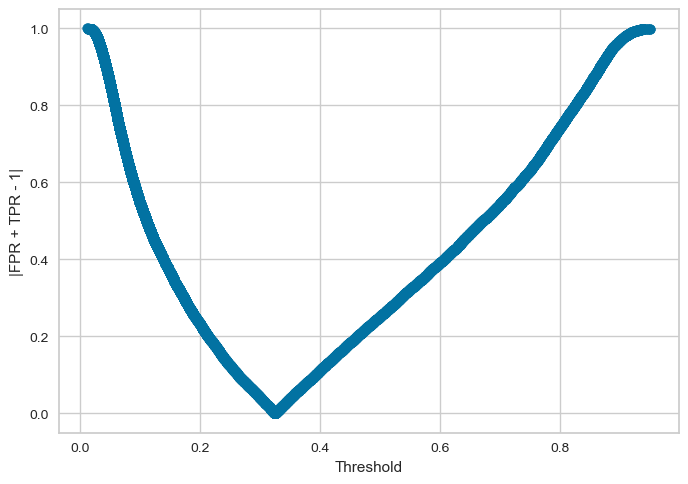
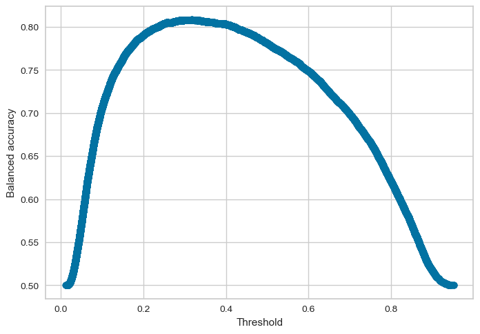
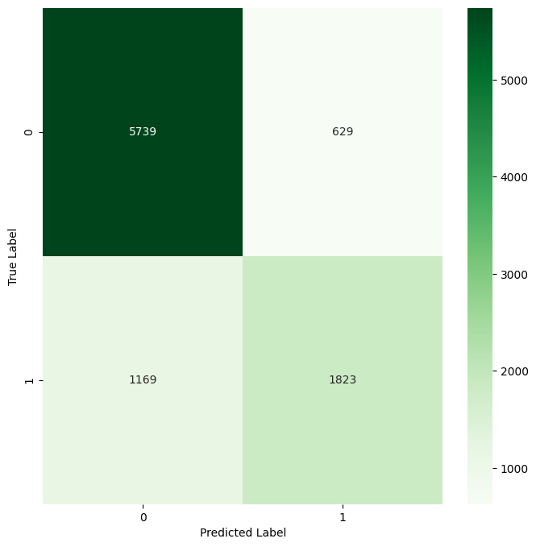
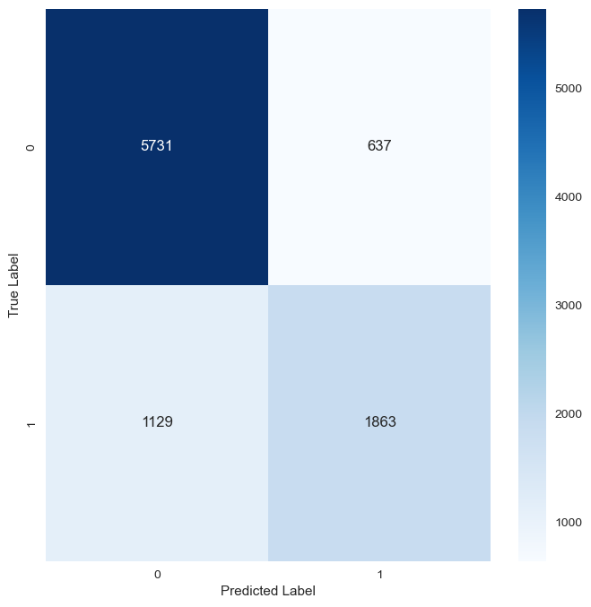
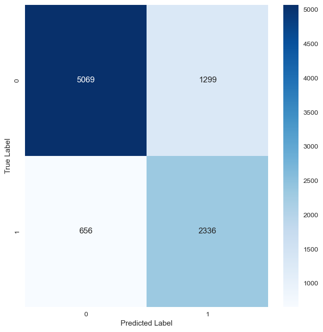

## 개인 프로젝트
클래스(class)가 다소 불균형한 이진 분류 문제를 해결하기 위해 다음과 같은 식을 이용하여 최적의 임곗값(threshold)를 찾은 다음, 이 임곗값을 적용해 예측(분류)을 수행했습니다.


이 식은 TPR(p) = 1-FPR(p) 식을 이용한 것입니다. 이때, 1-FPR(p) = TNR(p)입니다. 

TPR은 실제 양성 중에서 양성으로 올바르게 감지한 비율이며, 진양성률이라고 부릅니다.

FPR은 실제는 음성인데 양성으로 잘못 검출한 비율입니다. 즉, 1 - FPR은 실제 음성 중에서 음성으로 올바르게 감지한 비율이며, TNR(진음성률)이라고 부릅니다. FPR - 1 = - TNR이므로 위의 식을 TPR(p) - TNR(p)로 바꿀 수 있습니다.

위의 식을 argmin_p|TPR(p) - TNR(p)|로 보면, 이 식은 TPR과 TNR의 차이가 가장 작아지는 임곗값 p를 찾는다는 의미입니다. 즉, TPR과 TNR이 동일하거나(차이가 0이거나), 최소한 가장 가까워지는 지점을 찾겠다는 것입니다. 간단히 말하면 '양성 클래스도 잘 검출하고, 음성 클래스도 비슷한 수준으로 잘 검출하는 균형 지점을 찾겠다'라고 해석할 수 있습니다.

## 문제 정의
이진 분류 문제에서 일반적으로 모델이 제공한 점수를 임곗값을 적용하여 예측을 수행합니다. 

Python의 scikit-learn 라이브러리에서 모델 인스턴스의 predict( ) 메서드를 호출할 때, 이 임곗값은 보통 기본값 0.5로 설정됩니다.

0.5는 1일 확률이 0일 확률보다 크다는 것을 보장하는 자연스러운 임곗값입니다.

그러나 이것은 단순한 가정이기 때문에, 데이터에 기반하여 적절한 임곗값을 설정해야 합니다. 즉, 데이터에 따라 0.5가 적합한 임곗값이 아닐 수도 있습니다.

특히, 불균형한 비율의 클래스를 가지는 데이터의 경우 특정 클래스에 대한 데이터가 많으므로, 전체 정확도는 높게 나올 수 있으나 데이터가 적은 클래스에 대한 재현율(recall)이나 정밀도(precision) 값이 매우 낮게 나타날 수 있습니다. 이는 분류  문제에 있어 바람직한 결과가 아닙니다.

불균형 데이터의 문제를 해결하는 방법은 다양합니다. 대표적으로 다양한 업샘플링(Upsampling)과 다운샘플링(Downsampling) 기법들이 있습니다. 

다만, 다운샘플링은 데이터를 축소하기 때문에 정보 손실이, 업샘플링은 주어진 데이터 셋에 대한 성능이 향상될 수는 있으나, unseen data에 대한 예측 성능이 좋지 않을 수 있습니다. 

그러므로 샘플링 기법을 사용하는 대신, 데이터에 기반하여 클래스 불균형 문제를 완화하고자 합니다.

## Stack
```
Python
PyCaret
Keras  
TensorFlow  
```

# 코드 실행
## 1. Data preprocessing
아래 Jupyter Notebook markdown으로 기술되어 있음
https://github.com/HyunJae0/imbalanced-data-binary-classification/blob/main/preprocessing.ipynb

### 1.1 데이터 설명 및 변수 선정
사용한 데이터는 통계청 MDIS(Microdata Integrated Service)에서 제공받은 '2020년 주거실태조사' 데이터입니다. 해당 데이터는 설문 조사 응답자 46,976명에 대한 인구통계학적 정보와 주택과 관련된 정보입니다.

예측에 사용한 종속 변수는 '공공임대주택 입주의향(0, 1)'이며, 독립 변수는 관련 연구인 '공공임대주택 입주의향 영향요인에 관한 연구'에서 사용한 변수를 사용했습니다. 해당 연구는 이항 로짓 회귀분석을 이용해 어떤 요인이 공공임대주택 입주의향에 영향을 미치는지 분석을 진행하였습니다.

종속 변수의 클래스는 다음과 같이 다소 불균형한 비율을 가지고 있습니다.


### 1.2 RobustScaler와 One-Hot Encoding
예측에 사용한 독립 변수와 종속 변수는 다음과 같습니다.


독립 변수 중 수치형 변수의 경우 나이부터 가구원수 그리고 소득, 자산까지 수치 값의 차이가 크기 때문에 예측 과정에서 소득이나 자산을 이상치로 간주할 수 있습니다. 이 점을 고려하여 RobustScaler(X-median/IQR(Q3-Q1))를 적용해 모든 수치형 변수들이 같은 스케일을 가지도록 하였습니다.
그리고 범주형 변수에는 원-핫 인코딩을 적용했습니다.
```
# 숫자형 변수
num = new_df.select_dtypes(include=['int64', 'float64'])
# 범주형 변수
cat = new_df.select_dtypes(include=['object', 'category'])
num = num.drop('Intention to move into public rental housing', axis = 1) # 수치형 변수 중 종속변수 제외 
## 종속 변수를 별도로 보관
a=new_df[['Intention to move into public rental housing']]
```

스케일링과 인코딩이 적용된 데이터 프레임을 합칩니다.
```
from sklearn.preprocessing import RobustScaler

scaler = RobustScaler()
scaler.fit(num)
num_scaled=scaler.transform(num)
num_df_scaled=pd.DataFrame(data=num_scaled, columns=num.columns)
cat_dummies=pd.get_dummies(cat).astype(np.float32)

## 데이터 합치기
comp=pd.concat([num_df_scaled,cat_dummies,a],axis=1)
```

예측에 사용될 최종 데이터 프레임은 다음과 같으며, 종속 변수를 포함해 총 127개의 feature를 가집니다.
```
comp
```


## 2. ML/DL 모델 생성
아래 Jupyter Notebook markdown으로 기술되어 있음
[https://github.com/HyunJae0/imbalanced-data-binary-classification/blob/main/preprocessing.ipynb
](https://github.com/HyunJae0/imbalanced-data-binary-classification/blob/main/classification.ipynb)

서로 다른 패러다임을 가지는 머신러닝 모델과 딥러닝 모델을 만들어 예측을 수행하고자 합니다. 

두 모델은 모델 구조와 학습 방식이 근본적으로 다릅니다. 예를 들어 두 모델 모두 학습 과정에 영향을 주는 여러 하이퍼파라미터가 존재하지만, 설정해야 하는 하이퍼파라미터의 의미와 종류가 크게 다릅니다.

Tree 계열의 모델(랜덤 포레스트나 LightGBM 등)은 max_depth(트리 최대 깊이)나 num_leaves(트리의 최대 리프 노드 개수) 등 트리 구조 관련 하이퍼파라미터를 설정하지만, 딥러닝 모델은 레이어의 수, 뉴런 수, 배치 크기 그리고 비선형 문제를 풀기 위한 ReLU같은 활성화 함수 등을 설정하기 때문에 튜닝 방식에도 큰 차이가 있습니다. 

또한, 머신 러닝 모델은 비교적 특성(feature) 중요도나 Tree를 시각화하여 분류 과정을 해석하기 수월하지만, 딥러닝은 왜 0또는 1이라고 판단했는지 직관적으로 파악하기가 상대적으로 어렵습니다.

머신러닝 모델은 머신 러닝 워크플로를 자동화하는 오픈소스 라이브러리인 PyCaret을 이용해 선정하였고, 딥러닝 모델은 Keras API를 지원하는 딥러닝 프레임워크 TensorFlow를 이용해 은닉층, 드롭아웃 계층, 배치정규화 계층을 하나씩 추가하는 방식으로 단순한 완전연결계층(Fully Connected Layer)기반 모델을 만들어 예측을 수행했습니다.

### 2.1 PyCaret
PyCaret을 이용하면 분류, 회귀 등의 문제에서 사용하는 다양한 모델들을 동일한 환경에서 몇 줄의 코드로 성능을 비교하고 튜닝을 진행할 수 있습니다.

해결하고자 하는 문제가 분류 문제이므로 PyCaret의 classification 모듈을 사용했습니다. 먼저, setup( )을 통해 train/valid set, 종속 변수, seed, CV fold 수를 지정합니다.
```
from pycaret.classification import *

train_data = pd.concat([X_train, y_train], axis=1) # 훈련 데이터 합치기
valid_data = pd.concat([X_valid, y_valid], axis=1) # 검층 데이터 합치기

clf = setup(data=train_data,
            test_data = valid_data,
           target='Intention to move into public rental housing', # 종속 변수 컬럼명
           session_id=123,  # 재현성을 위한 시드 설정
           fold=10)  # 교차 검증 폴드 수
```

그다음, 10-CV를 통해 계산된 모델들의 성능을 평가한 후, 성능이 가장 우수한 모델을 반환합니다. 
```
# 여러 모델 비교
best_model = compare_models()
```


이때, 모델 선정은 AUC 값을 기준으로 하였습니다. AUC는 x축이 TPR y축이 FPR인 ROC 곡선의 아래 영역에 대한 면적으로 모델의 분류 능력을 0에서 1 사이의 값으로 나타내며, 1에 가까울수록 양성과 음성을 구분하는 능력이 뛰어나기 때문에 불균형 데이터 셋을 사용할 경우 AUC가 더 큰 모델이 좋습니다.

LGBM 모델을 선택한 후, tune_model( )로 하이퍼파라미터가 튠닝된 LGBM 모델을 다음과 같이 반환하였습니다.
```
# 최적 모델 선택 및 학습
final_model = create_model(best_model)

# 모델 튜닝
tuned_model = tune_model(final_model)
tuned_model
```


tuned_model을 기반으로 예측을 수행합니다. 이때의 train set은 기존의 train set과 valid set이 합쳐진 데이터 셋입니다.
```
# 모델 학습
lgbm_model.fit(X_train, y_train)
# 테스트 세트에 대한 예측
y_pred = lgbm_model.predict(X_test)
```

모델의 성능을 확인하기 위해 혼동 행렬을 확인합니다.
```
print('\nClassification Report:')
print(classification_report(y_test, y_pred))
```

모델의 정확도는 0.81로 준수하지만, 이는 음성(0)에 대한 데이터 수가 양성(1)보다 많기 때문에 클래스 0에 대해 높은 성능을 보이지만, 클래스 1에 대해 상대적으로 낮은 성능을 보입니다.
이렇게 불균형한 데이터에서는 정확도만으로 모델 성능을 평가하기 어렵습니다. 특히, 클래스가 불균형할 경우 다수 클래스(여기서는 클래스 0)에 대한 높은 정확도가 반영되기 때문입니다.
실제로 클래스 0에 대한 recall 0.9는 실제 클래스 0 샘플을 모델이 거의 정확히 예측했음을, precision 0.84는 모델이 클래스 0으로 예측한 것 중 상당수가 정확했음을 확인할 수 있습니다.
반면, 클래스 1에 대한 recall은 0.62, precision은 0.75로 실제 클래스 1 중 약 38%를 놓쳤으며 클래스 1로 예측한 것 중 25%가 잘못된 예측임을 확인할 수 있습니다. 이러한 결과는 불균형 데이터의 전형적인 문제입니다.

참고로 Pycaret을 이용하면 양성 또는 음성 예측에 어떤 변수들이 영향을 미쳤는지 확인할 수 있습니다.
```
interpret_model(tuned_model, plot='summary')
```


### 2.2 TensorFlow
Sequential API를 이용해 모델을 만들었으며, LearningRateScheduler을 이용해 초반에는 큰 step size로 빠르게 학습하고 epoch 5부터는 학습률을 지수적으로 줄여 좀 더 세밀하게 학습을 진행했습니다.
그리고 best model을 선정하기 위해 EarlyStopping으로 val_accuracy(검증 정확도)가 10 epoch 이후에도 개선되지 않으면 학습을 중단했으며, ModelCheckpoint를 이용해 val_loss(검증 손실)가 가장 낮았던 모델만 저장했습니다.
그리고 ReLU 활성화 함수를 사용하기 때문에 가중치를 He Normal로 설정했습니다.

모델의 Input은 데이터의 특징 수로 지정하였으며, 층이 깊어질수록 노드(뉴런)의 수를 줄여 정보를 압축했습니다. 

모델 구조는 Dense(Affine 계층) → BatchNormalization(배치 정규화 계층) → ReLU(활성화 함수 계층) → Dropout(드롭아웃 계층) 패턴으로 모델의 층을 쌓았습니다. ReLU 함수는 데이터의 값이 0 미만이면 0, 0 이상이면 그 값을 그대로 출력하기 때문에 은닉층을 쌓았을 때 0이 계속 전달될 수 있습니다. 이를 방지하고자 ReLU 계층 전에 배치 정규화 계층을 넣었습니다. 그리고 과적합을 억제하고, ML의 앙상블 효과를 얻기 위해 드롭아웃 계층을 넣었습니다. 마지막 계층은 이진 분류 문제이기 때문에 시그모이드 함수를 사용했습니다. 출력 뉴런이 1개이기 때문에 0~1 사이의 값을 얻으며, 결과는 확률로 해석할 수 있습니다. 결과가 1에 가까우면 입주의향 'yes'의 확률이 높은 것, 0에 가까우면 입주의향 'yes'의 확률이 낮은 것으로 해석할 수 있습니다.

모델 성능 지표는 정확도를 사용했으며, 손실 함수는 이진 분류에서 사용하는 손실 함수 binary_crossentropy를 사용했습니다. 그리고 옵티마이저로는 Adam을 사용했습니다.

train/valid set에 대한 학습 결과는 다음과 같습니다.
```
hist=model.fit(X_train, y_train, validation_data=(X_valid, y_valid), epochs=100, callbacks=callbacks_list)
```

train set과 valid set에 대한 정확도는 약 80~81%의 성능을 보이며, 각 data set의 loss를 확인하면 과대/과소 적합이 발생하지 않고, 잘 학습된 것을 확인할 수 있습니다.

best model을 저장하고 다시 불러옵니다.
```
#model.save('best_model.keras')
model2 = keras.models.load_model('best_model.keras')
```

이제 unseen data인 test data에 대한 정확도를 확인합니다.
```
score=model2.evaluate(X_test,y_test)
print('%s: %.2f%%' %(model2.metrics_names[1],score[1]*100))
```

test data에 대해서도 약 81%의 정확도를 보입니다.

위의 LGBM의 임곗값은 default로 설정된 0.5입니다. 딥러닝 모델도 임곗값을 0.5로 설정해서 혼동 행렬을 확인하였습니다.
```
y_pred = model2.predict(X_test)
y_pred = np.where(y_pred > 0.5, 1, 0)  # 0.5를 기준으로 이진 분류

print(classification_report(y_test, y_pred))
```

위의 LGBM 모델과 사실상 동일한 결과가 나오는 것을 확인할 수 있습니다. 

두 모델 모두 하이퍼파라미터 설정 방법만 다를 뿐, 일련의 튜닝을 적용한 모델들입니다. 그리드 서치를 사용하거나 사전 학습된 모델을 사용하는 방법으로, 두 모델 모두 약간의 성능 개선은 기대할 수 있지만, 임곗값을 0.5로 사용할 경우 클래스 1의 recall 값은 크게 달라지지 않을 것입니다.
이 문제는 공공임대주택 입주의향이기 때문에 실제로 입주의향이 있는 사람을 올바르게 예측하는 것이 더 중요합니다.

## 3. 최적의 임곗값(optimal threshold) 찾기
### 3.1 ROC Curve를 이용한 최적의 임곗값(optimal threshold) 찾기
Python에서 sklearn.metrics의 roc_curve를 이용하면, ROC 곡선을 계산해서 FPR, TPR 그리고 임곗값(모델 예측 확률의 임곗값)을 반환할 수 있습니다. 이때 drop_intermediate 파라미터를 False로 지정하여 모든 가능한 임곗값을 구합니다.
```
fpr, tpr, thresholds = roc_curve(y_train,lgbm_model.predict_proba(X_train)[:,1],drop_intermediate=False)
```

그다음, '|TPR + FPR - 1|'값이 0이 되는 지점을 찾습니다. 이 지점이 바로 TPR = TNR인 '균형 지점'입니다.
```
i = np.arange(len(tpr))
roc = pd.DataFrame({'fpr' : pd.Series(fpr, index=i),'tpr' : pd.Series(tpr, index = i), '1-fpr' : pd.Series(1-fpr, index = i), 'tf' : pd.Series(tpr - (1-fpr), index = i), 'thresholds' : pd.Series(thresholds, index = i)})
roc.iloc[(roc.tf-0).abs().argsort()[:1]]
```


파란색 곡선은 TPR, 빨간색 곡선은 TNR입니다. 두 곡선이 교차하는 지점이 바로 TPR과 TNR이 같아지는 임곗값 0.325006을 의미합니다.

```
plt.scatter(thresholds, np.abs(fpr+tpr-1))
plt.xlabel("Threshold")
plt.ylabel("|FPR + TPR - 1|")
plt.show()
```



### 3.2 Balanced Accuracy를 이용한 찾기
다른 접근 방법으로 Balanced Accuracy를 사용해 불균형 데이터 셋에 대한 정확도를 극대화하는 임곗값을 찾습니다.

Balanced Accuracy는 클래스 불균형이 있을 때, 양쪽 클래스를 고루 잘 맞추는지 평가하기 위한 지표로 TPR과 TNR의 평균. 즉, 각 클래스별 정답 비율의 평균으로 계산됩니다. Balanced Accuracy = TPR + TNR / 2

TPR = TP / TP + FN이고 TNR = TN / TN + FP이므로 Balanced Accuracy는 정확한 예측(진양성, 진음성)의 총 수를 예측의 총 수로 나눈 값입니다.

Balanced Accuracy를 이용해서 최적의 임곗값을 찾기 위해 모든 점수(예측 확률값)를 순회하면서 Balanced Accuracy를 평가 지표로 사용해 예측을 수행합니다. 더 정확하게는 train set에 대해 가능한 모든 점수를 임곗값으로 가정해 보면서, 어떤 임곗값에서 가장 높은 Balanced Accuracy를 얻을 수 있는지를 탐색합니다. 가장 높은 Balanced Accuracy를 기록할 때의 임곗값이 '균형 정확도가 가장 높은 임곗값'입니다.
```
from sklearn.metrics import balanced_accuracy_score
lgbm_model.fit(X_train,y_train)
threshold = []
accuracy = []
for p in np.unique(lgbm_model.predict_proba(X_train)[:,1]):
    threshold.append(p)
    y_pred = (lgbm_model.predict_proba(X_train)[:,1] >= p).astype(int)
    accuracy.append(balanced_accuracy_score(y_train,y_pred))
```

```
plt.scatter(threshold,accuracy)
plt.xlabel("Threshold")
plt.ylabel("Balanced accuracy")
plt.show()
```


```
threshold[np.argmax(accuracy)]
```
이때의 임곗값은 0.316581141508869입니다. 이제 이 임곗값을 사용해서 예측을 수행합니다.
```
lgbm_model.fit(X_train, y_train)
threshold = 0.316581141508869 # 임곗값 0.316581141508869 적용
y_pred = (y_pred_prob >= threshold).astype(int)

print('\nClassification Report:')
print(classification_report(y_test, y_pred))
```

혼동 행렬을 확인하면 기본 임곗값 0.5를 적용했을 때에 비해 클래스 1에 대한 recall 값이 0.16 증가한 것을 확인할 수 있습니다. 하지만, 클래스 1과 클래스 0을 분류하는 균형 지점을 찾았기 때문에 클래스 0에 대한 recall 값이 0.1 감소했습니다. 그러나 실제로 입주의향이 있는 사람을 올바르게 예측하는 것이 더 중요하게 가정하였기 때문에 다소 성공적인 결과입니다.

## 결과
첫 번째와 두 번째 혼동 행렬은 딥러닝 모델과 LGBM 모델로 임곗값 0.5를 사용했을 때의 결과입니다.



다음 혼동 행렬은 Balanced Accuracy를 이용해서 임곗값 0.316581141508869을 사용했을 때의 결과입니다.


두 번째 혼동 행렬과 세 번째 혼동 행렬을 비교해 보면, 실제로 입주의향이 없는 사람을 모델이 입주의향이 있는 사람이라고 잘못 예측한 수가 증가하긴 했지만, 실제로 입주의향이 있는 사람을 입주의향이 없는 사람이라고 잘못 예측한 수가 줄어들고, 실제 입주의향이 있는 사람을 입주의향이 있는 사람이라고 올바르게 예측한 수가 증가한 것을 확인할 수 있습니다.

보고서 링크: https://github.com/HyunJae0/imbalanced-data-binary-classification/blob/main/%EB%B3%B4%EA%B3%A0%EC%84%9C%20%EB%B0%8F%20%EB%B0%9C%ED%91%9C%EC%9E%90%EB%A3%8C/%EB%B3%B4%EA%B3%A0%EC%84%9C.pdf
