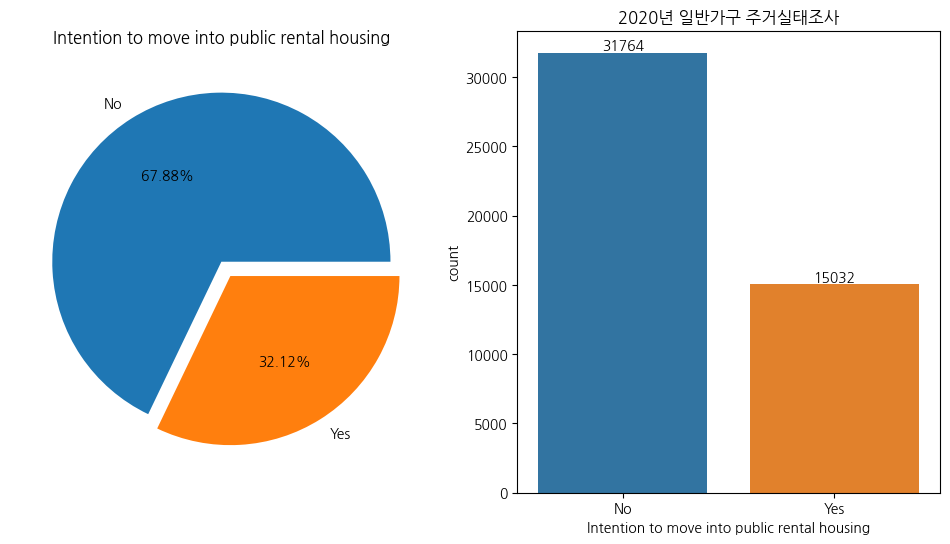

## 1. Problem

binary classifier가 확률 $\hat{p}(x) = P(y=1 \mid x)$를 출력했을 때, 최종 예측 레이블은 threshold $t$로 결정된다: $\hat{y}(t) = \mathbf{1}[\hat{p}(x) \ge t]$, 여기서 $\mathbf{1}$은 indicator function

많은 확률 기반의 classifier에서 $ t= 0.5 $를 기본값으로 사용한다. 즉, 양성(positive) 확률이 0.5를 초과하면, 이를 양성으로 분류한다.

겉보기엔 $t=0.5$가 합리적인 선택처럼 보이지만, 모든 경우에 대해 최적이라고 보장할 수는 없다. imbalanced data인 상황이 대표적인 예이다.

클래스가 불균형한 경우 accuracy가 높더라도 소수 클래스에 대한 recall이 낮아질 수 있다. 

recall은 실제 True 중에서 모델이 True로 예측한 비율, precision은 모델이 True라고 예측한 것 중 실제로 True인 비율이다. 두 지표 모두 모델이 True로 올바르게 예측한 경우에 관심을 두지만, 관점은 다르다.

전체 데이터 수를 $N$이라고 할 때, accuracy는 $\dfrac{TP + TN}{TP + TN + FP + FN} = \dfrac{TP + TN}{N}$로 계산된다.

소수/다수 클래스가 각각 1과 0일 때, 다수 클래스의 수를 $N_0$, 소수 클래스의 수를 $N_1$이라고 하자: $N=N_0 +N_1, \; N_1 \ll N_0$

예를 들어, 모델이 전부 다수 클래스 0으로만 예측하면 $TP=0, FP=0, FN=N_1, TN=N_0$이며, 이때의 accuracy는 $\dfrac{N_0}{N_0 + N_1} = \dfrac{N_0}{N} = 1- \dfrac{N_1}{N}$이 된다.

$\dfrac{N_1}{N} = 0.01$이면 99%의  accuracy가 산출된다. 그러나 이 경우 $TP=0$으로 소수 클래스에 대한 분류 능력이 전혀 없으며, accuracy는 이러한 한계를 전혀 반영하지 못한다.

이러한 클래스 불균형 문제를 완화하기 위해 일반적으로 많이 사용되는 방법 중 하나가 샘플링 기법이다.

기존 소수 클래스 데이터를 그대로 복제하거나, 이를 기반으로 새로운 소수 클래스의 데이터를 생성하는 방법인 오버샘플링은 과적합 위험이 있고, 다수 클래스를 줄이는 다운샘플링은 학습 정보 손실 가능성이 있다.

특히, 다운샘플링은 다수 클래스를 줄이는 과정에서 다수 클래스를 분류하기 위한 중요한 정보가 손실될 수 있다.

공공임대주택 입주의향("있음"/"없음")을 예측하는 문제는 다음과 같은 두 가지 이유에서 두 클래스 간 균형 있는 예측이 필요하다.
- (1) FN: 실제 입주의향이 "있음"에도 "없음"으로 예측하는 경우 $ \rightarrow $ 수요를 과소 추정하여 공급 부족을 초래할 수 있다.
- (2) FP: 실제 입주의향이 "없음"에도 "있음"으로 예측하는 경우 $ \rightarrow $ 수요를 과대 추정하여 공실 문제를 초래할 수 있다.

그러므로, 두 클래스 모두를 균형 있게 예측하는 것이 중요하다.

---

## 2. Data

- 출처: 통계청 MDIS(Microdata Integrated Service) **2020년 주거실태조사**
- 종속 변수: **공공임대주택 입주의향 (0/1)**, 0=="입주의향 없다"와 1=="입주의향 있다"이며, 클래스 비율은 68:32로 약간 불균형한 상태

  

- 독립 변수: [관련연구](https://kpa1959.or.kr/file/E104.pdf)(공공임대주택 입주의향 영향요인)에 사용된 변수들을 기반으로 구성
- 정책 기준에 부합하는 가구들을 필터링한 결과, 최종 데이터 수는 **46,796**
- 수치형 변수(예: 나이, 소득, 자산, 부채 등)의 이상치로 인한 영향을 최소화하고자 **RobustScaler** 사용
- 범주형 변수의 경우 **One-Hot Encoding**으로 처리

---
