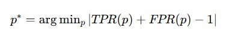
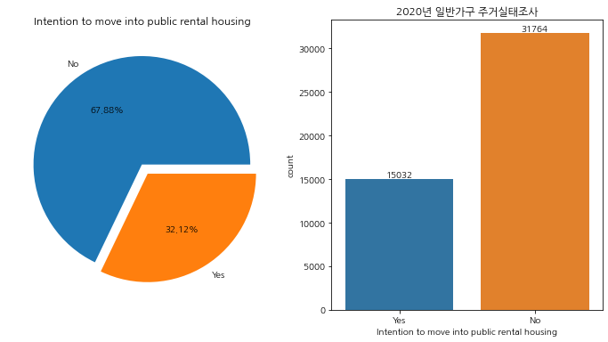

## 개인 프로젝트
클래스(class)가 다소 불균형한 이진 분류 문제를 해결하기 위해 다음과 같은 식을 이용하여 최적의 임곗값(threshold)를 찾은 다음, 이 임곗값을 적용해 예측(분류)을 수행했습니다.



## 문제 정의
이진 분류 문제에서 일반적으로 모델이 제공한 점수를 임곗값을 적용하여 예측을 수행합니다. 

Python의 scikit-learn 라이브러리에서 모델 인스턴스의 predict( ) 메서드를 호출할 때, 이 임곗값은 보통 기본값 0.5로 설정됩니다.

0.5는 1일 확률이 0일 확률보다 크다는 것을 보장하는 자연스러운 임곗값입니다.

그러나 이것은 단순한 가정이기 때문에, 데이터에 기반하여 적절한 임곗값을 설정해야 합니다. 즉, 데이터에 따라 0.5가 적합한 임곗값이 아닐 수도 있습니다.

특히, 불균형한 비율의 클래스를 가지는 데이터의 경우 특정 클래스에 대한 데이터가 많으므로, 전체 정확도는 높게 나올 수 있으나 데이터가 적은 클래스에 대한 재현율(recall)이나 정밀도(precision) 값이 매우 낮게 나타날 수 있습니다. 이는 분류  문제에 있어 바람직한 결과가 아닙니다.

불균형 데이터의 문제를 해결하는 방법은 다양합니다. 대표적으로 다양한 업샘플링(Upsampling)과 다운샘플링(Downsampling) 기법들이 있습니다. 

다만, 다운샘플링은 데이터를 축소하기 때문에 정보 손실이, 업샘플링은 주어진 데이터 셋에 대한 성능이 향상될 수는 있으나, unseen data에 대한 예측 성능이 좋지 않을 수 있습니다. 

그러므로 샘플링 기법을 사용하는 대신, 데이터에 기반하여 클래스 불균형 문제를 완화하고자 합니다.

## Stack
```
Python
PyCaret
Keras  
TensorFlow  
```

# 코드 실행
## 1. Data preprocessing
아래 Jupyter Notebook markdown으로 기술되어 있음
https://github.com/HyunJae0/imbalanced-data-binary-classification/blob/main/preprocessing.ipynb

### 1.1 데이터 설명 및 변수 선정
사용한 데이터는 통계청 MDIS(Microdata Integrated Service)에서 제공받은 '2020년 주거실태조사' 데이터입니다. 해당 데이터는 설문 조사 응답자 46,976명에 대한 인구통계학적 정보와 주택과 관련된 정보입니다.

예측에 사용한 종속 변수는 '공공임대주택 입주의향(0, 1)'이며, 독립 변수는 관련 연구인 '공공임대주택 입주의향 영향요인에 관한 연구'에서 사용한 변수를 사용했습니다. 해당 연구는 이항 로짓 회귀분석을 이용해 어떤 요인이 공공임대주택 입주의향에 영향을 미치는지 분석을 진행하였습니다.

종속 변수의 클래스는 다음과 같이 다소 불균형한 비율을 가지고 있습니다.



### 1.2 RobustScaler와 One-Hot Encoding
예측에 사용한 독립 변수와 종속 변수는 다음과 같습니다.


독립 변수 중 수치형 변수의 경우 나이부터 가구원수 그리고 소득, 자산까지 수치 값의 차이가 크기 때문에 예측 과정에서 소득이나 자산을 이상치로 간주할 수 있습니다. 이 점을 고려하여 RobustScaler(X-median/IQR(Q3-Q1))를 적용해 모든 수치형 변수들이 같은 스케일을 가지도록 하였습니다.
그리고 범주형 변수에는 원-핫 인코딩을 적용했습니다.
```
# 숫자형 변수
num = new_df.select_dtypes(include=['int64', 'float64'])
# 범주형 변수
cat = new_df.select_dtypes(include=['object', 'category'])
num = num.drop('Intention to move into public rental housing', axis = 1) # 수치형 변수 중 종속변수 제외 
## 종속 변수를 별도로 보관
a=new_df[['Intention to move into public rental housing']]
```

스케일링과 인코딩이 적용된 데이터 프레임을 합칩니다.
```
from sklearn.preprocessing import RobustScaler

scaler = RobustScaler()
scaler.fit(num)
num_scaled=scaler.transform(num)
num_df_scaled=pd.DataFrame(data=num_scaled, columns=num.columns)
cat_dummies=pd.get_dummies(cat).astype(np.float32)

## 데이터 합치기
comp=pd.concat([num_df_scaled,cat_dummies,a],axis=1)
```

예측에 사용될 최종 데이터 프레임은 다음과 같으며, 종속 변수를 포함해 총 127개의 feature를 가집니다.
```
comp
```


## 2. ML/DL 모델 생성
서로 다른 패러다임을 가지는 머신러닝 모델과 딥러닝 모델을 만들어 예측을 수행하고자 합니다. 

두 모델은 모델 구조와 학습 방식이 근본적으로 다릅니다. 예를 들어 두 모델 모두 학습 과정에 영향을 주는 여러 하이퍼파라미터가 존재하지만, 설정해야 하는 하이퍼파라미터의 의미와 종류가 크게 다릅니다.

Tree 계열의 모델(랜덤 포레스트나 LightGBM 등)은 max_depth(트리 최대 깊이)나 num_leaves(트리의 최대 리프 노드 개수) 등 트리 구조 관련 하이퍼파라미터를 설정하지만, 딥러닝 모델은 레이어의 수, 뉴런 수, 배치 크기 그리고 비선형 문제를 풀기 위한 ReLU같은 활성화 함수 등을 설정하기 때문에 튜닝 방식에도 큰 차이가 있습니다. 

또한, 머신 러닝 모델은 비교적 특성(feature) 중요도나 Tree를 시각화하여 분류 과정을 해석하기 수월하지만, 딥러닝은 왜 0또는 1이라고 판단했는지 직관적으로 파악하기가 상대적으로 어렵습니다.

머신러닝 모델은 머신 러닝 워크플로를 자동화하는 오픈소스 라이브러리인 PyCaret을 이용해 선정하였고, 딥러닝 모델은 Keras API를 지원하는 딥러닝 프레임워크 TensorFlow를 이용해 은닉층, 드롭아웃 계층, 배치정규화 계층을 하나씩 추가하는 방식으로 단순한 완전연결계층(Fully Connected Layer)기반 모델을 만들어 예측을 수행했습니다.

### 2.1 PyCaret
PyCaret을 이용하면 분류, 회귀 등의 문제에서 사용하는 다양한 모델들을 동일한 환경에서 몇 줄의 코드로 성능을 비교하고 튜닝을 진행할 수 있습니다.

해결하고자 하는 문제가 분류 문제이므로 PyCaret의 classification 모듈을 사용했습니다. 먼저, setup( )을 통해 train/valid set, 종속 변수, seed, CV fold 수를 지정합니다.
```
from pycaret.classification import *

train_data = pd.concat([X_train, y_train], axis=1) # 훈련 데이터 합치기
valid_data = pd.concat([X_valid, y_valid], axis=1) # 검층 데이터 합치기

clf = setup(data=train_data,
            test_data = valid_data,
           target='Intention to move into public rental housing', # 종속 변수 컬럼명
           session_id=123,  # 재현성을 위한 시드 설정
           fold=10)  # 교차 검증 폴드 수
```

그다음, 10-CV를 통해 계산된 모델들의 성능을 평가한 후, 성능이 가장 우수한 모델을 반환합니다. 
```
# 여러 모델 비교
best_model = compare_models()
```


이때, 모델 선정은 AUC 값을 기준으로 하였습니다. AUC는 x축이 TPR y축이 FPR인 ROC 곡선의 아래 영역에 대한 면적으로 모델의 분류 능력을 0에서 1 사이의 값으로 나타내며, 1에 가까울수록 양성과 음성을 구분하는 능력이 뛰어나기 때문에 불균형 데이터 셋을 사용할 경우 AUC가 더 큰 모델이 좋습니다.

LGBM 모델을 선택한 후, tune_model( )로 하이퍼파라미터가 튠닝된 LGBM 모델을 다음과 같이 반환하였습니다.
```
# 최적 모델 선택 및 학습
final_model = create_model(best_model)

# 모델 튜닝
tuned_model = tune_model(final_model)
tuned_model
```


참고로 Pycaret을 이용하면 양성 또는 음성 예측에 어떤 변수들이 영향을 미쳤는지 확인할 수 있습니다.
```
interpret_model(tuned_model, plot='summary')
```


### 2.2 TensorFlow


